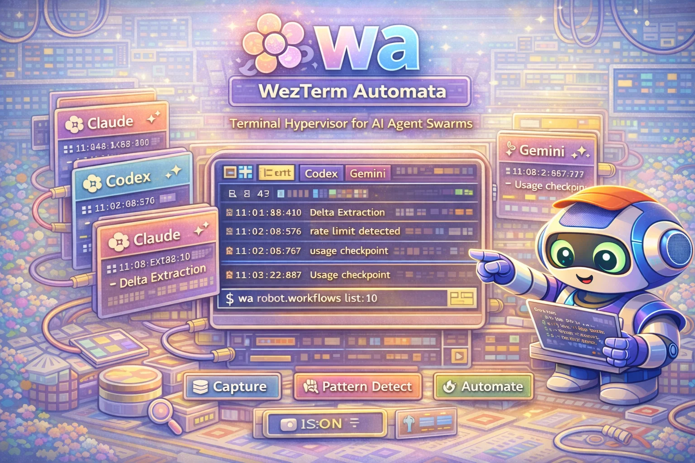

# wa — WezTerm Automata

<div align="center">
  
</div>

<div align="center">

[](https://github.com/Dicklesworthstone/wezterm_automata/actions/workflows/ci.yml)
[](https://opensource.org/licenses/MIT)
[](https://www.rust-lang.org/)

</div>

**The central nervous system for coordinating fleets of AI coding agents across WezTerm terminal sessions.**

<div align="center">
<h3>Quick Install</h3>

```bash
cargo install --git https://github.com/Dicklesworthstone/wezterm_automata.git wa
```

</div>

---

## TL;DR

**The Problem**: Running multiple AI coding agents (Claude Code, Codex CLI, Gemini CLI) across terminal panes is chaos. You can't see what they're doing, can't detect when they hit rate limits or need input, and can't coordinate their work without manual babysitting and fragile timing heuristics.

**The Solution**: `wa` transforms WezTerm into a **terminal hypervisor** — capturing all pane output in real-time, detecting agent state transitions through pattern matching, automatically executing workflows in response, and exposing a machine-optimized Robot Mode API for AI-to-AI orchestration.

### Why Use wa?

| Feature | What It Does |
|---------|--------------|
| **Perfect Observability** | Captures all terminal output across all panes with delta extraction (<50ms lag) |
| **Intelligent Detection** | Multi-agent pattern engine detects rate limits, errors, prompts, completions |
| **Event-Driven Automation** | Workflows trigger on patterns — no sleep loops or polling heuristics |
| **Robot Mode API** | JSON interface optimized for AI agents to control other AI agents |
| **Full-Text Search** | FTS5-powered search across all captured output with BM25 ranking |
| **Policy Engine** | Capability gates, rate limiting, audit trails for safe multi-agent control |

---

## Quick Example

```bash
# Start the wa daemon (observes all WezTerm panes)
$ wa daemon start

# See all active panes as JSON
$ wa robot state
{
  "ok": true,
  "data": {
    "panes": [
      {"pane_id": 0, "title": "claude-code", "domain": "local", "cwd": "/project"},
      {"pane_id": 1, "title": "codex", "domain": "local", "cwd": "/project"}
    ]
  }
}

# Compact TOON output (token-optimized)
$ wa robot --format toon state

# Token stats (printed to stderr so stdout stays data-only)
$ wa robot --format toon --stats state

# Get recent output from a specific pane
$ wa robot get-text 0 --lines 50

# Wait for a specific pattern (e.g., agent hitting rate limit)
$ wa robot wait-for 0 "core.codex:usage_reached" --timeout 3600

# Search all captured output
$ wa robot search "error: compilation failed"

# Send input to a pane (with policy checks)
$ wa robot send 1 "/compact"

# View recent detection events
$ wa robot events --limit 10
```

---

## Design Philosophy

### 1. Passive-First Architecture

The observation loop (discovery, capture, pattern detection) has **no side effects**. It only reads and stores. The action loop (sending input, running workflows) is strictly separated with explicit policy gates.

### 2. Event-Driven, Not Time-Based

No `sleep(5)` loops hoping the agent is ready. Every wait is condition-based: wait for a pattern match, wait for pane idle, wait for an external signal. Deterministic, not probabilistic.

### 3. Delta Extraction Over Full Capture

Instead of repeatedly capturing entire scrollback buffers, `wa` uses 4KB overlap matching to extract only new content. Efficient storage, minimal latency, explicit gap markers for discontinuities.

### 4. Single-Writer Integrity

A watcher lock ensures only one daemon can write to the database. No corruption from concurrent mutations. Graceful fallback for read-only introspection.

### 5. Agent-First Interface

Robot Mode returns structured JSON with consistent schemas. Every response includes `ok`, `data`, `error`, `elapsed_ms`, and `version`. Designed for machines to parse, not humans to read.

---

## How wa Compares

| Feature | wa | tmux scripting | Manual monitoring |
|---------|-----|----------------|-------------------|
| Multi-pane capture | Full scrollback + delta | Capture-pane (snapshot) | One pane at a time |
| Pattern detection | <5ms, multi-agent | Manual grep | Human eyes |
| Event-driven waits | Built-in | Polling loops | Not possible |
| Full-text search | FTS5 with ranking | grep + manual | Not practical |
| Policy/safety | Capability gates | None | Trust |
| Robot Mode API | First-class JSON | Script parsing | N/A |

**When to use wa:**
- Running 2+ AI coding agents that need coordination
- Building automation that reacts to terminal output
- Debugging multi-agent workflows with full observability

**When wa might not be ideal:**
- Single terminal, single agent (overkill)
- Non-WezTerm terminal emulators (WezTerm-specific APIs)

---

## Installation

### From Source (Recommended)

```bash
# Clone and build
git clone https://github.com/Dicklesworthstone/wezterm_automata.git
cd wezterm_automata
cargo build --release

# Install to PATH
cp target/release/wa ~/.local/bin/
```

### Via Cargo

```bash
cargo install --git https://github.com/Dicklesworthstone/wezterm_automata.git wa
```

### Requirements

- **Rust 1.85+** (nightly required for Rust 2024 edition)
- **WezTerm** terminal emulator with CLI enabled
- **SQLite** (bundled via rusqlite)

---

## Quick Start

### 1. Verify WezTerm CLI

```bash
# Should list your current panes
wezterm cli list
```

### 2. Start the Daemon

```bash
# Start observing all panes
wa daemon start

# Or run in foreground for debugging
wa daemon run --log-level debug
```

### 3. Check Status

```bash
# See what wa is observing
wa status

# Robot mode for JSON output
wa robot state
```

### 4. Search Captured Output

```bash
# Full-text search across all panes
wa search "error"

# Robot mode with structured results
wa robot search "compilation failed" --limit 20
```

### 5. React to Events

```bash
# Wait for an agent to hit its rate limit
wa robot wait-for 0 "core.codex:usage_reached"

# Then send a command to handle it
wa robot send 0 "/compact"
```

---

## Commands

### Daemon Management

```bash
wa daemon start              # Start daemon in background
wa daemon stop               # Stop running daemon
wa daemon run                # Run in foreground
wa daemon status             # Check if running
```

### Pane Inspection

```bash
wa status                    # Overview of observed panes
wa show <pane_id>           # Detailed pane info
wa get-text <pane_id>       # Recent output from pane
```

### Search

```bash
wa search "<query>"          # Full-text search
wa search "<query>" --pane 0 # Scope to specific pane
wa search "<query>" --limit 50
```

### Explainability

```bash
wa why --list                # List available explanation templates
wa why deny.alt_screen       # Explain a common policy denial
```

### Robot Mode (JSON API)

```bash
wa robot state               # All panes as JSON
wa robot get-text <id>      # Pane output as JSON
wa robot send <id> "<text>" # Send input (with policy)
wa robot send <id> "<text>" --dry-run  # Preview without executing
wa robot wait-for <id> <rule_id>       # Wait for pattern
wa robot search "<query>"   # Search with structured results
wa robot events             # Recent detection events
wa robot help               # List all robot commands
```

### Configuration

```bash
wa config show               # Display current config
wa config validate           # Check config syntax
wa config reload             # Hot-reload config (SIGHUP)
```

---

## Configuration

Configuration lives in `~/.config/wa/wa.toml`:

```toml
[general]
# Logging level: trace, debug, info, warn, error
log_level = "info"
# Output format: pretty (human) or json (machine)
log_format = "pretty"
# Data directory for database and locks
data_dir = "~/.local/share/wa"

[ingest]
# How often to poll panes for new content (milliseconds)
poll_interval_ms = 200
# Filter which panes to observe
[ingest.panes]
include = []  # Empty = all panes
exclude = ["*htop*", "*vim*"]  # Glob patterns

[storage]
# Write queue size for batched inserts
writer_queue_size = 100
# How long to retain captured output
retention_days = 30

[patterns]
# Which detection packs to enable
packs = ["core"]
# Core pack detects: Claude Code, Codex, Gemini state transitions

[workflows]
# Enable automatic workflow execution on pattern matches
enabled = true
# Maximum concurrent workflows
concurrency = 10

[safety]
# Require approval for actions on new hosts
approve_new_hosts = true
# Redact sensitive patterns (API keys, tokens) in logs
redact_secrets = true
# Rate limits per action type
[safety.rate_limits]
send_text = { max_per_second = 2 }
```

---

## Architecture

```
┌─────────────────────────────────────────────────────────────────────────┐
│                           WezTerm Multiplexer                           │
│   Pane 0 (Claude)    Pane 1 (Codex)    Pane 2 (Gemini)    Pane N...   │
└─────────────────────────────────────────────────────────────────────────┘
                                   │
                    wezterm cli list / get-text
                                   ▼
┌─────────────────────────────────────────────────────────────────────────┐
│                         Ingest Pipeline                                  │
│   Discovery → Delta Extraction → Fingerprinting → Observation Filter    │
└─────────────────────────────────────────────────────────────────────────┘
                                   │
                                   ▼
┌─────────────────────────────────────────────────────────────────────────┐
│                         Storage Layer (SQLite + FTS5)                   │
│   output_segments │ events │ workflow_executions │ audit_actions        │
└─────────────────────────────────────────────────────────────────────────┘
                                   │
                    ┌──────────────┼──────────────┐
                    ▼              ▼              ▼
             ┌───────────┐  ┌───────────┐  ┌───────────┐
             │  Pattern  │  │   Event   │  │  Workflow │
             │  Engine   │  │    Bus    │  │  Engine   │
             │ (detect)  │  │ (fanout)  │  │ (execute) │
             └───────────┘  └───────────┘  └───────────┘
                    │              │              │
                    └──────────────┼──────────────┘
                                   ▼
┌─────────────────────────────────────────────────────────────────────────┐
│                         Policy Engine                                    │
│   Capability Gates │ Rate Limiting │ Audit Trail │ Approval Tokens      │
└─────────────────────────────────────────────────────────────────────────┘
                                   │
                                   ▼
┌─────────────────────────────────────────────────────────────────────────┐
│                         Robot Mode API                                   │
│   wa robot state │ get-text │ send │ wait-for │ search │ events        │
└─────────────────────────────────────────────────────────────────────────┘
```

### Data Flow

1. **Discovery**: Enumerate panes via `wezterm cli list`
2. **Capture**: Get output via `wezterm cli get-text`
3. **Delta**: Compare with previous capture using 4KB overlap matching
4. **Store**: Append new segments to SQLite with FTS5 indexing
5. **Detect**: Run pattern engine against new content
6. **Event**: Broadcast detections to event bus subscribers
7. **Workflow**: Execute registered workflows on matching events
8. **Policy**: Gate all actions through capability and rate limit checks
9. **API**: Expose everything via Robot Mode JSON interface

---

## Pattern Detection

`wa` detects state transitions across multiple AI coding agents:

| Agent | Pattern Examples |
|-------|------------------|
| **Codex** | `core.codex:usage_reached`, `core.codex:compaction_complete` |
| **Claude Code** | `core.claude:rate_limited`, `core.claude:approval_needed` |
| **Gemini** | `core.gemini:quota_exceeded`, `core.gemini:error` |
| **WezTerm** | `core.wezterm:pane_closed`, `core.wezterm:title_changed` |

### Pattern IDs

Every detection has a stable `rule_id` like `core.codex:usage_reached`. Use these in:
- `wa robot wait-for <pane_id> <rule_id>` — wait for specific condition
- Workflow triggers — automatically react to patterns
- Allowlists — suppress false positives

---

## Troubleshooting

### "wezterm cli list" returns empty

```bash
# Ensure WezTerm is running with multiplexer enabled
wezterm start --always-new-process
```

### Daemon won't start: "watcher lock held"

Another `wa` daemon is already running.

```bash
# Check for existing daemon
wa daemon status

# Force stop if stuck
wa daemon stop --force

# Or remove stale lock
rm ~/.local/share/wa/watcher.lock
```

### High memory usage

Delta extraction is failing; falling back to full captures.

```bash
# Check for gaps in capture
wa robot events --type gap

# Reduce poll interval
# In wa.toml:
[ingest]
poll_interval_ms = 500  # Slower polling
```

### Pattern not detecting

```bash
# Enable debug logging
wa daemon run --log-level trace

# Test pattern manually
echo "your terminal output" | wa pattern test "core.codex:usage_reached"
```

### Robot mode returns errors

```bash
# Check daemon is running
wa daemon status

# Verify pane exists
wezterm cli list

# Check policy blocks
wa robot send 0 "test" --dry-run
```

---

## Limitations

### What wa Doesn't Do (Yet)

- **Non-WezTerm terminals**: Relies on WezTerm's CLI protocol. tmux/iTerm2 not supported.
- **Remote panes without SSH**: WezTerm SSH domains work; raw remote terminals don't.
- **GUI interaction**: Detects terminal output only, not graphical elements.
- **Distributed coordination**: Single-host only; multi-host federation planned for v2.

### Known Limitations

| Capability | Current State | Planned |
|------------|---------------|---------|
| Browser automation (OAuth) | Feature-gated, partial | v0.2 |
| MCP server integration | Planned | v0.2 |
| Web dashboard | Not started | v0.3 |
| Multi-host federation | Not started | v2.0 |

---

## FAQ

### Why "wa"?

**W**ezTerm **A**utomata. Short, typeable, memorable.

### Is my terminal output stored permanently?

By default, output is retained for 30 days (configurable via `storage.retention_days`). Data is stored locally in SQLite at `~/.local/share/wa/wa.db`.

### Does wa send data anywhere?

No. Everything stays local. No telemetry, no cloud, no network calls except to WezTerm's local CLI.

### Can I use wa without running AI agents?

Yes. The pattern detection and search work for any terminal output. Useful for debugging, auditing, or building custom automation.

### How do I add custom patterns?

Edit `~/.config/wa/patterns.toml`:

```toml
[[patterns]]
id = "custom:my_error"
pattern = "FATAL ERROR:.*"
severity = "critical"
```

### What's the performance overhead?

- **CPU**: <1% during idle; brief spikes during pattern detection
- **Memory**: ~50MB for daemon with 100 panes
- **Disk**: ~10MB/day for typical multi-agent usage (compressed deltas)
- **Latency**: <50ms average capture lag

---

## About Contributions

Please don't take this the wrong way, but I do not accept outside contributions for any of my projects. I simply don't have the mental bandwidth to review anything, and it's my name on the thing, so I'm responsible for any problems it causes; thus, the risk-reward is highly asymmetric from my perspective. I'd also have to worry about other "stakeholders," which seems unwise for tools I mostly make for myself for free. Feel free to submit issues, and even PRs if you want to illustrate a proposed fix, but know I won't merge them directly. Instead, I'll have Claude or Codex review submissions via `gh` and independently decide whether and how to address them. Bug reports in particular are welcome. Sorry if this offends, but I want to avoid wasted time and hurt feelings. I understand this isn't in sync with the prevailing open-source ethos that seeks community contributions, but it's the only way I can move at this velocity and keep my sanity.

---

## License

MIT License. See [LICENSE](LICENSE) for details.

---

<div align="center">

**Built for the AI agent age. Observability without compromise.**

</div>
